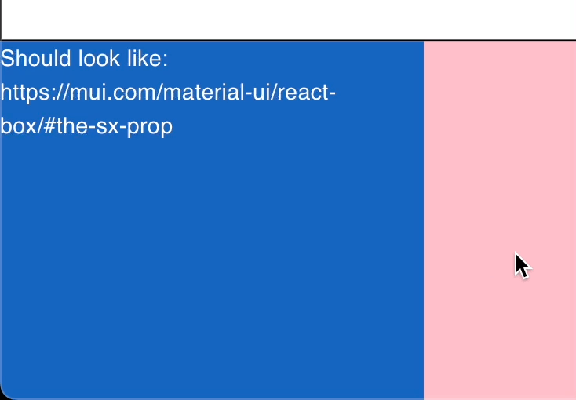

# 🩳 MUI sx syntax

You can use the [MUI's Sx syntax](https://mui.com/system/getting-started/the-sx-prop/) in MUI like so:&#x20;

```jsx
import { makeSxStyles } from "tss-react/mui";
import { unstable_styleFunctionSx as styleFunctionSx } from "@mui/system";

function TestSxComponent() {

    const { classes } = useStyles();

    return (
        <div className={classes.root}>
            Should look like: https://mui.com/material-ui/react-box/#the-sx-prop
        </div>
    );

};

const useStyles = makeStyles()(theme => styleFunctionSx({
    theme,
    "sx": {
        "root": {
            "width": 300,
            "height": 300,
            "backgroundColor": 'primary.dark',
            '&:hover': {
                "backgroundColor": 'primary.main',
                "opacity": [0.9, 0.8, 0.7]
            }
        }
    }
}));
```

<figure><figcaption></figcaption></figure>
