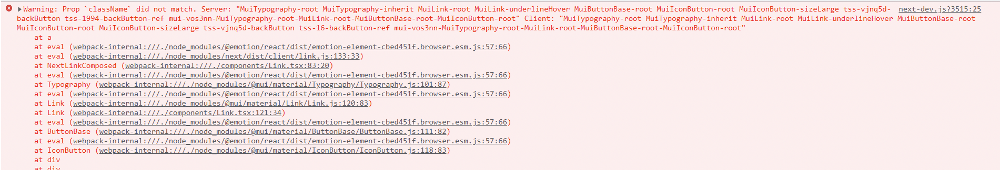

# 💫 Nested selectors (ex $ syntax)

`tss-react` unlike `jss-react` doesn't support the `$` syntax but a better alternative.

## `makeStyles`

In **JSS** you can do:

```jsx
//WARNIG: This is legacy JSS code!
{
  "parent": {
      "padding": 30,
      "&:hover $child": {
          "backgroundColor": "red"
      },
  },
  "child": {
      "backgroundColor": "blue"
  }
}
//...
<div className={classes.parent}>
    <div className={classes.child}>
        Background turns red when the mouse is hover the parent
    </div>
</div>
```


This is how you would achieve the same result with `tss-react`

```jsx
export function App() {
    const { classes } = useStyles();

    return (
        <div className={classes.parent}>
            <div className={classes.child}>
                Background turns red when mouse is hover the parent.
            </div>
        </div>
    );
}

const useStyles = makeStyles<void, "child">()(
    (_theme, _params, classes) => ({
        "parent": {
            "padding": 30,
            [`&:hover .${classes.child}`]: {
                "backgroundColor": "red"
            }
        },
        "child": {
            "backgroundColor": "blue"
        },
    })
);
```

An other example:

```tsx
export function App() {
    const { classes, cx } = useStyles({ "color": "primary" });

    return (
        <div className={classes.root}>
            <div className={classes.child}>
                The Background take the primary theme color when the mouse is
                hover the parent.
            </div>
            <div className={cx(classes.child, classes.small)}>
                The Background take the primary theme color when the mouse is
                hover the parent. I am smaller than the other child.
            </div>
        </div>
    );
}

const useStyles = makeStyles<
    { color: "primary" | "secondary" },
    "child" | "small"
>()((theme, { color }, classes) => ({
    "root": {
        "padding": 30,
        [`&:hover .${classes.child}`]: {
            "backgroundColor": theme.palette[color].main
        }
    },
    "small": {},
    "child": {
        "border": "1px solid black",
        "height": 50,
        [`&.${classes.small}`]: {
            "height": 30
        }
    }
}));
```


The render of the avove code


> WARNING: Nested selectors requires [ES6 Proxy](https://developer.mozilla.org/en-US/docs/Web/JavaScript/Reference/Global\_Objects/Proxy) support which [IE doesn't support](https://developer.mozilla.org/en-US/docs/Web/JavaScript/Reference/Global\_Objects/Proxy#browser\_compatibility).\
> It can't be polyfilled ([this](https://github.com/GoogleChrome/proxy-polyfill) will not work) but don't worry, if `Proxy` is not available on a particular browser, no error will be thrown and TSS will still do its work.\
> Only nested selectors won't work.

## `withStyles`



## SSR

With server side rendering enabled you could end up with warnings like: &#x20;


`Warning: Prop className did not match. Server: "tss-XXX-root-ref" Client: "tss-YYY-root-ref"`.




You can fix this error by providing an uniq id when calling `makeStyles` or `withStyles` (It will set XXX and YYY). &#x20;


Short unique identifiers can be generated with [this website](https://shortunique.id/).


```diff
 const useStyles = makeStyles<
     { color: "primary" | "secondary" },
     "child" | "small"
 >({
     name: "MyComponent"
+    uniqId: "QnWmDL"
 })((theme, { color }, classes) => ({
     "root": {
         "padding": 30,
         [`&:hover .${classes.child}`]: {
             "backgroundColor": theme.palette[color].main
         }
     },
     "small": {},
     "child": {
         "border": "1px solid black",
         "height": 50,
         [`&.${classes.small}`]: {
             "height": 30
         }
     }
 }));
 
  const MyBreadcrumbs = withStyles(
     Breadcrumbs,
     (theme, _props, classes) => ({
         "ol": {
             [`& .${classes.separator}`]: {
                 "color": theme.palette.primary.main
             }
         }
     }), 
     {
          name: "MyBreadcrumbs",
+         uniqId: "vZHt3n" 
     }
 );
```
